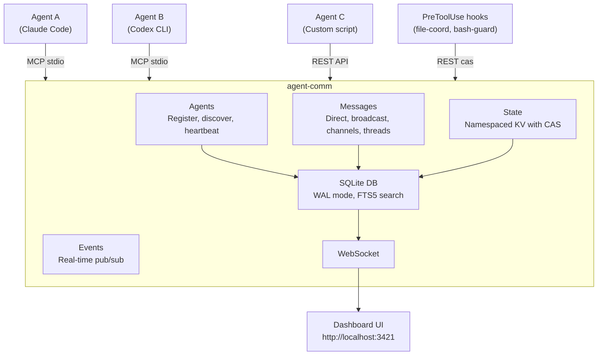
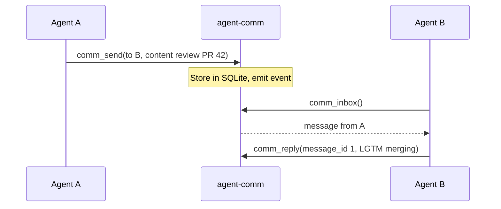
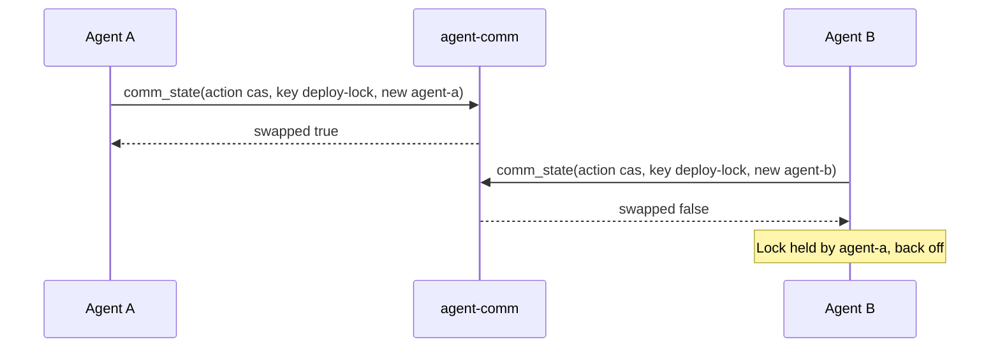

# agent-comm

[](LICENSE)
[](https://nodejs.org/)
[]()
[]()
[]()

**Agent-agnostic intercommunication system.** Lets AI coding agents — Claude Code, Codex CLI, Gemini CLI, Aider, or any custom tool — talk to each other, share state, and coordinate work in real time.

| Light Theme                                | Dark Theme                                     |
| ------------------------------------------ | ---------------------------------------------- |
|  |  |

## Why

When you run multiple AI agents on the same codebase — code review in one terminal, implementation in another, testing in a third — they have no idea the others exist. They duplicate work, create merge conflicts, and miss context.

|                   | Without agent-comm                   | With agent-comm                                      |
| ----------------- | ------------------------------------ | ---------------------------------------------------- |
| **Discovery**     | Agents don't know others exist       | Agents register with skills, discover by capability  |
| **Coordination**  | Edit the same file, create conflicts | Lock files/regions, divide work                      |
| **Communication** | None — each agent works blind        | Messages, channels, broadcasts                       |
| **State sharing** | Duplicate work, missed context       | Shared KV store with atomic CAS                      |
| **Visibility**    | No idea what's happening             | Real-time dashboard + activity feed shows everything |

**agent-comm** gives them a shared communication layer:

- Agents **register** with a name, capabilities, and skills so others can discover them
- They **discover** each other by skill or tag for dynamic task routing
- They exchange **messages** (direct, broadcast, or channel-based) to coordinate, with importance levels (`low`/`normal`/`high`/`urgent`) and optional ack
- They **poll** their inbox with a blocking wait (`comm_poll`) so mid-flight peer signals are consumed without busy-looping
- They share **state** (a key-value store with atomic CAS) for locks, flags, and progress
- They log **activity events** (commits, test results, file edits) to a shared feed
- They detect **stuck agents** — alive (heartbeat OK) but not making progress
- They **serialize file edits** via the system-layer `file-coord` hook (see below) so parallel agents on shared files cannot clobber each other
- A **web dashboard** shows everything in real time, including an Activity Feed tab

It works with any agent that supports [MCP](https://modelcontextprotocol.io/) (stdio transport) or can make HTTP requests (REST API).

### Why hooks, not just MCP tools

The MCP tools (`comm_state`, etc.) give agents the _primitives_ to coordinate, but they don't _enforce_ coordination — the agent has to remember to call them. Our [bench](bench/README.md) measured what happens when you rely on the model's discretion: **even with strict procedural prompting, Claude follows the protocol on the first claim cycle then drifts back to "be helpful, finish the task."** Soft coordination is unreliable.

The fix is a pair of `PreToolUse` hooks shipped in `scripts/hooks/`: **`file-coord`** intercepts every `Edit`/`Write`/`MultiEdit` and claims the file via REST `POST /api/state/file-locks/<path>/cas` (blocks the edit if another agent holds the lock); **`bash-guard`** intercepts `git commit`, `git push`, `npm install`, `npm test`, builds, migrations, and dev-server starts and blocks/warns when they would conflict with another session's WIP. **The protocol becomes infrastructure, not a prompt the agent might ignore.**

The bench's headline pilot is **`multi-term-commit`** — directly modeling the daily pain of two terminal sessions on the same project. Session A edits two files but doesn't commit. Session B then edits two other files and runs `git commit -am "my work"`. Without the hook, B's commit silently includes A's WIP. With the hook, B's commit is blocked at the bash layer with an actionable message, and B reacts (selective staging, restore, or coordinate). Bench result:

|               | naive (no hook)                            | **with hooks**            |
| ------------- | ------------------------------------------ | ------------------------- |
| Commit purity | **MIXED** — bar.js, baz.js, foo.js, qux.js | **PURE — baz.js, qux.js** |
| Wall time     | 91.0s                                      | **78.8s (-13%)**          |
| Total cost    | $0.774                                     | **$0.591 (-24%)**         |
| Outcome       | A's WIP silently committed under B's name  | clean commit, no clobber  |

The hook is **faster AND cheaper**, not just safer. Reason: when agents lack coordination on shared workspaces, they read stale state, get confused mid-task, retry, and re-think. Serializing access and surfacing the conflict early removes that wasted thinking. Run `npm run setup` to install both hooks automatically; see [Setup → File Coordination](docs/SETUP.md#pretooluse--posttooluse--scriptshooksfile-coordmjs) for manual install on Claude Code, OpenCode, or any custom MCP client. See [bench/README.md](bench/README.md) for the measurement methodology.

### How agent-comm fits together

`agent-comm` is a single Node process that exposes three transports — MCP stdio (for AI hosts), REST + WebSocket (for hooks, dashboards, custom scripts) — backed by a SQLite database in WAL mode. Hooks installed in your Claude Code (or other host) settings call the REST endpoint at `localhost:3421` to claim file locks, query who-edited-what, and broadcast presence. The dashboard UI at the same port is a live view of every agent, message, channel, and shared-state entry. Multiple AI hosts can connect simultaneously and see the same world.



## Quick start

### Install from npm

```bash
npm install -g agent-comm
```

### Or clone from source

```bash
git clone https://github.com/keshrath/agent-comm.git
cd agent-comm
npm install
npm run build
```

### Option 1: MCP server (for any MCP-compatible AI host)

agent-comm runs as a stdio MCP server, so any MCP-compatible host can use it.
Tested hosts include Claude Code, Cline, OpenCode, Cursor (read-only state),
Windsurf, Codex CLI, Aider, and Continue.dev. Adapter recipes for each are in
[docs/SETUP.md](docs/SETUP.md#client-setup).

Generic MCP config:

```json
{
  "mcpServers": {
    "agent-comm": {
      "command": "npx",
      "args": ["agent-comm"]
    }
  }
}
```

Add this to your host's MCP config file (the path varies by host —
`~/.claude.json` for Claude Code, `~/.config/opencode/config.json` for
OpenCode, `~/.cursor/config.json` for Cursor, etc. — see the per-host
sections in `docs/SETUP.md`).

The dashboard auto-starts at http://localhost:3421 on the first MCP connection
regardless of which host is connected.

### Option 2: Standalone server (for REST/WebSocket clients)

```bash
node dist/server.js --port 3421
```

### Option 3: Automated setup (Claude Code)

```bash
npm run setup
```

Registers the MCP server in `~/.claude.json`, installs the [hook scripts](docs/SETUP.md#hooks) (lifecycle + file-coord + bash-guard), and configures permissions. **Other hosts**: see [docs/SETUP.md](docs/SETUP.md#client-setup) for the per-host integration recipes — every host that supports pre-tool-call hooks can use the same `file-coord.mjs` script unchanged.

## MCP tools (7)

| Tool            | Description                                                                                                           |
| --------------- | --------------------------------------------------------------------------------------------------------------------- |
| `comm_register` | Register with name, capabilities, metadata, skills, and auto-join channels                                            |
| `comm_agents`   | Agent management — actions: `list`, `discover`, `whoami`, `heartbeat`, `status`, `unregister`                         |
| `comm_send`     | Send messages — direct (`to`), channel, broadcast, reply (`reply_to`), forward (`forward`), optional `correlation_id` |
| `comm_inbox`    | Read inbox (direct + channel messages, unread filter, `importance` filter, thread view via `thread_id`)               |
| `comm_poll`     | Block until a new inbox message arrives (supports `timeout_ms` and `importance` filter)                               |
| `comm_channel`  | Channel management — actions: `create`, `list`, `join`, `leave`, `archive`, `update`, `members`, `history`            |
| `comm_state`    | Shared key-value state — actions: `set`, `get`, `list`, `delete`, `cas`                                               |

## REST API

All endpoints return JSON. CORS enabled. See [full API reference](docs/API.md) for details.

```
GET  /health                              Server status + uptime
GET  /api/agents                          List online agents
GET  /api/agents/:id                      Get agent by ID or name
GET  /api/agents/:id/heartbeat             Agent liveness (status + heartbeat age)
GET  /api/channels                        List active channels
GET  /api/channels/:name                  Channel details + members
GET  /api/channels/:name/members          Channel member list
GET  /api/channels/:name/messages         Channel messages (?limit=50)
GET  /api/messages                        List messages (?limit=50&from=&to=&offset=)
GET  /api/messages/:id/thread             Get thread
GET  /api/search?q=keyword                Full-text search (?limit=20&channel=&from=)
GET  /api/state                           List state entries (?namespace=&prefix=)
GET  /api/state/:namespace/:key           Get state entry
GET  /api/feed                              Activity feed events (?agent=&type=&since=&limit=50)
GET  /api/overview                        Full snapshot (agents, channels, messages, state)
GET  /api/export                          Full database export as JSON

POST   /api/messages                      Send a message (body: {from, to?, channel?, content, thread_id?, correlation_id?, importance?})
POST   /api/state/:namespace/:key         Set state (body: {value, updated_by})
POST   /api/state/:namespace/:key/cas     Atomic compare-and-swap (file-coord hook uses this)
DELETE /api/messages                       Purge all messages
DELETE /api/messages                       Delete messages by filter
DELETE /api/messages/:id                   Delete a message (body: {agent_id})
DELETE /api/state/:namespace/:key          Delete state entry
DELETE /api/agents/offline                 Purge offline agents
POST   /api/cleanup                       Trigger manual cleanup
POST   /api/cleanup/stale                 Clean up stale agents and old messages
POST   /api/cleanup/full                  Full database cleanup
```

## Agent visibility and status

`comm_agents` with `action: "heartbeat"` accepts an optional `status_text` parameter, letting agents update their visible status in the same call that keeps them online:

```jsonc
// MCP call — heartbeat + status update in one
comm_agents({ "action": "heartbeat", "status_text": "implementing auth module" })

// Clear status text (pass null)
comm_agents({ "action": "heartbeat", "status_text": null })

// Plain heartbeat — status text unchanged
comm_agents({ "action": "heartbeat" })
```

**Hosts that support lifecycle hooks** (Claude Code, OpenCode, future Cursor/Codex when they ship hook APIs) get automatic heartbeats, registration, and status via the lifecycle hook scripts shipped in `scripts/hooks/`. Subagents spawned by the Agent tool inherit the same registration via `SubagentStart`, so they appear on the dashboard alongside the main session. **Hosts without hook support** (Cursor, Windsurf, Aider as of 2025) can still use the MCP tools — agents must call `comm_register` and `comm_agents heartbeat` from the host's instructions file. **Custom MCP clients or scripts** can call the REST endpoints or use `comm_heartbeat` directly to show live progress.

The REST endpoint `GET /api/agents/:id/heartbeat` returns agent liveness info (status, heartbeat age in ms/s, status text) for external monitoring.

## Communication patterns

### Direct messaging



### Shared state with CAS (distributed locking)



## Dashboard


The web dashboard auto-starts at **http://localhost:3421** and shows agents, messages, channels, shared state, and the activity feed in real time. See the [Dashboard Guide](docs/DASHBOARD.md) for all views and features.

---

## Testing

```bash
npm test              # 288 tests across 16 files
npm run test:watch    # Watch mode
npm run test:e2e      # E2E tests only
npm run test:coverage # Coverage report
npm run check         # Full CI: typecheck + lint + format + test
```

## Environment variables

| Variable                    | Default | Description                                |
| --------------------------- | ------- | ------------------------------------------ |
| `AGENT_COMM_PORT`           | `3421`  | Dashboard HTTP/WebSocket port              |
| `AGENT_COMM_RETENTION_DAYS` | `7`     | Days before auto-purge of old data (1-365) |

## Documentation

- [Setup Guide](docs/SETUP.md) — installation, client setup (Claude Code, OpenCode, Cursor, Windsurf), hooks
- [Architecture](docs/ARCHITECTURE.md) — source structure, design principles, database schema
- [Dashboard](docs/DASHBOARD.md) — web UI views and features
- [Changelog](CHANGELOG.md)

## License

MIT — see [LICENSE](LICENSE)
